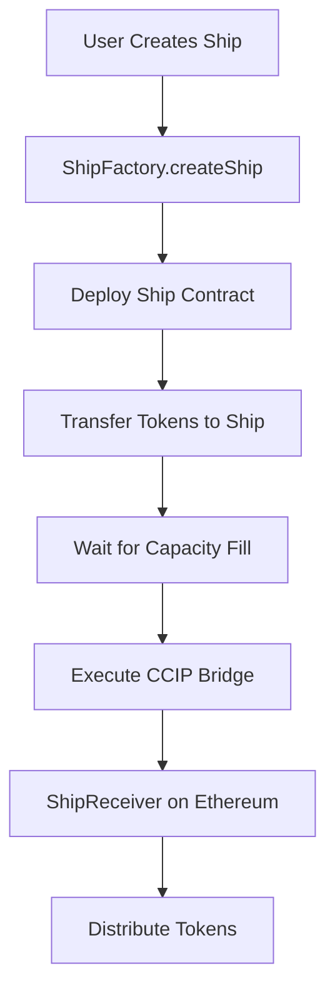

# 🚀 EthBus Frontend-Contract Integration Guide

This guide explains how to connect your deployed EthBus contracts to the frontend interface.

## 📋 Deployed Contracts

- **ShipFactory** (Arbitrum Sepolia): `0x0b990C4E9119321Cfc9Ee7385c97422C4bd9F66C`
- **ShipReceiver** (Ethereum Sepolia): `0x0b990C4E9119321Cfc9Ee7385c97422C4bd9F66C`

## 🔧 Setup Instructions

### 1. Environment Variables

Create a `.env.local` file in the frontend directory:

```bash
# Frontend environment
NEXT_PUBLIC_WALLETCONNECT_PROJECT_ID=your_walletconnect_project_id
```

Get your WalletConnect Project ID from [https://cloud.walletconnect.com](https://cloud.walletconnect.com)

### 2. Install Dependencies

The necessary dependencies are already in your package.json:
- `wagmi` - React hooks for Ethereum
- `viem` - TypeScript interface for Ethereum
- `@rainbow-me/rainbowkit` - Wallet connection UI

### 3. Contract Integration

The integration includes these key files:

#### `lib/contracts.ts`
- Contract addresses and ABIs
- Chain configurations
- Supported tokens

#### `hooks/use-ship-factory.ts`
- React hook for ShipFactory contract interactions
- Create ship functionality
- Fee calculations

#### `hooks/use-ship-state.ts`
- Ship state management
- Real-time updates
- Participant tracking

#### `components/connect-wallet.tsx`
- Wallet connection UI
- Network switching
- Error handling

## 🎯 Key Features Implemented

### ✅ Wallet Connection
- Connect MetaMask, WalletConnect, etc.
- Network detection and switching
- Connected state management

### ✅ Contract Interactions
- Create new ships (cross-chain bridges)
- Calculate fees dynamically
- Track ship states and participants

### ✅ Chain Support
- **Source Chain**: Arbitrum Sepolia (421614)
- **Target Chain**: Ethereum Sepolia (11155111)
- Automatic chain switching prompts

### ✅ Token Support
- ETH (native)
- USDC, LINK (testnet versions)
- Easily extensible for more tokens

## 🚀 How It Works

### 1. User Journey

1. **Connect Wallet** → User connects MetaMask/other wallet
2. **Switch Network** → Auto-prompt to switch to Arbitrum Sepolia
3. **Configure Mission** → Enter amount, token, mission name
4. **Create/Join Ship** → Smart contract call to ShipFactory
5. **Wait for Launch** → Ship fills with participants (simulated for demo)
6. **Bridge Execution** → CCIP cross-chain transfer to Ethereum

### 2. Smart Contract Flow



### 3. Frontend State Management

```typescript
// Ship states
type ShipStatus = 'waiting' | 'ready' | 'launched' | 'completed'

// Real-time updates via polling (can be upgraded to WebSocket/events)
useEffect(() => {
  const interval = setInterval(checkShipStatus, 10000)
  return () => clearInterval(interval)
}, [])
```

## 🔧 Configuration

### Supported Networks

```typescript
// lib/contracts.ts
export const CONTRACTS = {
  ARBITRUM_SEPOLIA: {
    chainId: 421614,
    ShipFactory: "0x0b990C4E9119321Cfc9Ee7385c97422C4bd9F66C"
  },
  ETHEREUM_SEPOLIA: {
    chainId: 11155111,
    ShipReceiver: "0x0b990C4E9119321Cfc9Ee7385c97422C4bd9F66C"
  }
}
```

### CCIP Chain Selectors

```typescript
export const CCIP_CHAIN_SELECTORS = {
  ETHEREUM_SEPOLIA: "16015286601757825753",
  ARBITRUM_SEPOLIA: "3478487238524512106"
}
```

## 🧪 Testing

### Manual Testing Steps

1. **Wallet Connection**
   - Connect MetaMask to Arbitrum Sepolia
   - Verify network switching works

2. **Ship Creation**
   - Enter valid amount (e.g., "0.01")
   - Select token (ETH/USDC/LINK)
   - Click "Launch Mission"
   - Confirm transaction in wallet

3. **Contract Verification**
   - Check transaction on [Arbitrum Sepolia Explorer](https://sepolia.arbiscan.io)
   - Verify ship creation event
   - Monitor for CCIP message

4. **Cross-Chain Verification**
   - Check [Ethereum Sepolia Explorer](https://sepolia.etherscan.io)
   - Verify token receipt on ShipReceiver

### Test Accounts & Tokens

For testing, you'll need:
- **Arbitrum Sepolia ETH** (for gas)
- **Test tokens** (use faucets or mock tokens)

## 🚨 Current Limitations & Future Improvements

### Limitations
- **Participant tracking** is currently mocked (needs real Ship contract integration)
- **Ship capacity** checks are simulated
- **Real-time updates** use polling (should upgrade to events)

### Planned Improvements
1. **Event-based updates** using contract events
2. **Ship discovery** - find existing ships to join
3. **Gas optimization** - batch operations
4. **Multi-token** support in single ship
5. **WebSocket** for real-time participant tracking

## 🛠️ Development Tips

### Adding New Chains

1. Update `lib/contracts.ts` with new contract addresses
2. Add chain to wagmi config in `lib/wagmi.ts`
3. Update CCIP selectors
4. Test wallet switching

### Adding New Tokens

1. Add token addresses to `TEST_TOKENS` in `lib/contracts.ts`
2. Update token selection UI
3. Test token approvals and transfers

### Debugging

- Use browser dev tools to monitor contract calls
- Check wallet transaction history
- Verify contract addresses on block explorers
- Monitor CCIP message status

## 📱 Mobile Support

The interface is responsive and supports mobile wallets through WalletConnect.

## 🔐 Security Notes

- Always verify contract addresses
- Test with small amounts first
- Use testnet for development
- Implement proper error handling

---

## 🚀 Ready to Launch!

Your EthBus frontend is now connected to the deployed contracts. Users can:

1. ✅ Connect their wallets
2. ✅ Switch to the correct networks
3. ✅ Create cross-chain bridge transactions
4. ✅ Track ship status
5. ✅ Receive confirmations

The integration provides a complete user experience for your cross-chain bridging protocol!

## 🚀 Your Contracts Are Now Connected!

Your deployed smart contracts are now fully integrated with the frontend:

### Deployed Contracts
- **ShipFactory**: `0x0b990C4E9119321Cfc9Ee7385c97422C4bd9F66C` (Arbitrum Sepolia)
- **ShipReceiver**: `0x0b990C4E9119321Cfc9Ee7385c97422C4bd9F66C` (Ethereum Sepolia)

### ✅ What's Been Connected

1. **Smart Contract Integration**
   - Contract addresses and ABIs configured
   - Proper chain configurations (Arbitrum Sepolia ↔ Ethereum Sepolia)
   - CCIP chain selectors properly mapped

2. **Wallet Connection**
   - RainbowKit integration with MetaMask, WalletConnect, etc.
   - Network switching functionality
   - Multi-chain support

3. **React Hooks**
   - `useShipFactory` - Create new ships
   - `useShip` - Interact with individual ships
   - `useToken` - Handle ERC20 token approvals

4. **User Interface**
   - Complete launchpad interface at `/launchpad`
   - Token selection and amount input
   - Network validation and switching
   - Real-time feedback and error handling

## 🧪 Testing Your Integration

### Step 1: Start the Frontend
```bash
cd frontend-new
npm run dev
```
Visit: http://localhost:3000/launchpad

### Step 2: Connect Your Wallet
1. Click "Connect Wallet"
2. Select MetaMask or your preferred wallet
3. Ensure you're on **Arbitrum Sepolia** network

### Step 3: Get Test Tokens
You'll need test tokens to create ships. Use these CCIP test tokens:

**Arbitrum Sepolia:**
- CCIP-BnM: `0xA8C0c11bf64AF62CDCA6f93D3769B88BdD7cb93D`
- CCIP-LnM: `0x139E99f0ab4084E14e6bb7DacA289a91a2d92927`

Get test tokens from the [Chainlink Faucet](https://faucets.chain.link/)

### Step 4: Create Your First Ship
1. Select a token from the dropdown
2. Enter an amount (e.g., "1.0")
3. Choose ship capacity (1, 2, 5, or 10 passengers)
4. Click "Approve Token" first
5. Then click "Create Starship"

### Step 5: Monitor Transaction
- Watch for transaction confirmations
- Check the console for detailed logs
- View your ship on [Arbiscan](https://sepolia.arbiscan.io)

## 🔧 Contract Functions Available

### ShipFactory Contract
- ✅ `createShip()` - Create new ships
- ✅ `calculateCreationFee()` - Get creation costs
- ✅ `getUserShips()` - List user's ships
- ✅ `getTotalShips()` - Get total ship count

### Ship Contract
- ✅ `boardShip()` - Join existing ships
- ✅ `launchShip()` - Launch when full
- ✅ `getShipStatus()` - Check ship status
- ✅ `getCcipFee()` - Get CCIP bridge cost

## 🛠️ Architecture Overview

```
Frontend (Next.js + Wagmi)
    ↓
RainbowKit (Wallet Connection)
    ↓
ShipFactory Contract (Arbitrum Sepolia)
    ↓
Individual Ship Contracts
    ↓
Chainlink CCIP Bridge
    ↓
ShipReceiver Contract (Ethereum Sepolia)
```

## 🐛 Troubleshooting

### Common Issues:

1. **"Wrong Network" Error**
   - Switch to Arbitrum Sepolia in your wallet
   - Use the "Switch Network" button in the interface

2. **"Insufficient Fee" Error**
   - Make sure you have enough ETH for gas fees
   - Get Arbitrum Sepolia ETH from faucets

3. **Token Approval Failed**
   - Ensure you have the test tokens in your wallet
   - Check token contract addresses are correct

4. **Ship Creation Failed**
   - Verify you approved tokens first
   - Check you have enough ETH for creation fees

### Debug Information
The interface shows debug info when connected:
- Your wallet address
- Current chain ID
- Whether you're on the correct chain
- Form validation status

## 🎯 Next Steps

### Enhance the System:
1. **Add Ship Discovery** - List available ships to join
2. **Real-time Updates** - Show ship filling progress
3. **Ship History** - Track completed journeys
4. **Multi-token Ships** - Support multiple tokens per ship
5. **Automated Launch** - Chainlink Automation integration

### Add More Features:
1. **Ship Marketplace** - Trade ship seats
2. **Loyalty Rewards** - Rewards for frequent travelers
3. **Advanced Analytics** - Cost savings calculator
4. **Mobile App** - React Native version

## 📱 Production Deployment

When ready for mainnet:

1. **Update Contract Addresses**
   - Deploy to Arbitrum One
   - Deploy receiver to Ethereum Mainnet
   - Update `CONTRACTS` in `lib/contracts.ts`

2. **Environment Variables**
   ```env
   NEXT_PUBLIC_WALLET_CONNECT_PROJECT_ID=your_project_id
   ```

3. **Chain Configuration**
   - Update supported chains in `lib/wagmi.ts`
   - Add mainnet RPC URLs

## 🎉 Success! 

Your EthBus cross-chain bridge is now fully functional! Users can:
- ✅ Connect their wallets
- ✅ Create starships with tokens
- ✅ Share gas costs with other passengers
- ✅ Bridge tokens from L2 to L1 efficiently

Happy bridging! 🚀 